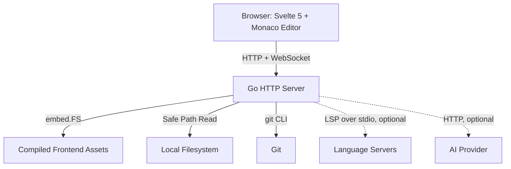

# Vidian 🔍

A lightweight, beautiful **read-only code viewer** that runs as a single Go binary and opens in your browser instantly. Built for quickly inspecting code, reading READMEs, and reviewing commit history — without the weight of a full IDE.

```bash
vidian .           # open current folder
vidian ~/projects  # open any folder
```

---

## Why Vidian?

When an AI generates code, or you need to quickly check a README, review a diff, or browse a commit — opening VS Code or a full IDE is often overkill. Vidian fills that gap:

- **Instant**: Opens a browser tab in under a second
- **Lightweight**: Single binary, `< 15 MB RAM` usage
- **Zero config**: No extensions, no config files, no workspace setup
- **Read-only**: Safe to point at any directory — no accidental edits

---

## Features

- 📁 **File Explorer** — Tree view with expand/collapse, color-coded file icons
- 📝 **Monaco Editor** — The same editor engine as VS Code, syntax highlighting for 100+ languages
- 🧠 **Code Intelligence** — Go-to-definition, find all references, a live symbol outline, and inline reference counts, plus peek and a copyable deep link to any file and line. Reuses a language server you already have installed (gopls, pylsp, typescript-language-server, rust-analyzer, clangd, lua-language-server, solargraph) — nothing to configure, and features degrade gracefully when no server is present.
- 🔍 **Global Search** — Full-text content search across all files
- ⚡ **Quick Open** — `Ctrl+P` to jump to any file instantly
- 🌿 **Git Integration**:
  - Browse commit history with full details in the main editor area
  - Side-by-side diff viewer for any changed file in a commit
  - View uncommitted changes (working tree vs HEAD)
  - Switch branches from the Git sidebar
- 📊 **Repo doc** — A single document that orients you in an unfamiliar project: a deterministic **Overview** (stack, entry points, key files) and **Insights** (commit-activity heatmap, most-changed hot files, contributor stats, language breakdown). No AI required; add a key for an AI-written tour on top.
- ✨ **AI Explain** — Ask an AI to explain any file, or just a selection, in plain English. Bring your own key: Anthropic, OpenAI, or any OpenAI-compatible endpoint.
- 📄 **Markdown Preview** — Rendered by default with a "View Raw" toggle back to Monaco
- 🗄️ **CSV & SQLite Viewer** — Browse data files and SQLite databases as tables, no spreadsheet app required
- 🎬 **Media & Images** — Video and audio play inline, images render directly, binary files show a metadata card

---

## Installation

Three ways to install — pick what fits your workflow.

---

> **Windows:** native Windows is not supported. Install [WSL](https://learn.microsoft.com/windows/wsl/install) first, then follow the Linux instructions below.

---

### Method 1: One-liner script *(Recommended)*

Downloads a pre-built binary for your OS and architecture:

```bash
curl -sSL https://raw.githubusercontent.com/Ucok23/vidian/master/install.sh | bash
```

**Supports:** Linux (amd64, arm64), macOS (amd64, arm64), WSL

To pin a specific version:
```bash
VIDIAN_VERSION=v1.0.0 curl -sSL https://raw.githubusercontent.com/Ucok23/vidian/master/install.sh | bash
```

---

### Method 2: Build from source *(For contributors)*

Clone and use the Makefile:

```bash
git clone https://github.com/Ucok23/vidian.git
cd vidian
make install
```

This builds the frontend + Go binary and copies it to `/usr/local/bin/vidian`.

Other useful Makefile targets:

```bash
make help        # Show all available targets
make build       # Build binary only (frontend must already be built)
make all         # Build frontend + binary (no install)
make uninstall   # Remove from /usr/local/bin
make clean       # Remove build artifacts
```

---

## Usage

```bash
vidian .                      # open current directory
vidian /path/to/project       # open a specific folder
vidian . -port 9000           # custom port (default: 8080)
```

Then open **[http://localhost:8080](http://localhost:8080)** in your browser.

### Flags

| Flag | Default | Description |
|:---|:---|:---|
| `-dir` | `.` | Path to workspace directory |
| `-port` | `8080` | HTTP port to listen on |
| `-dev` | `false` | Serve frontend from disk (for development) |

---

## Keyboard Shortcuts

| Shortcut | Action |
|:---|:---|
| `Ctrl + P` | Quick Open — search and jump to any file |
| `Ctrl + B` | Toggle sidebar visibility |
| `Ctrl + Shift + F` | Focus global search |
| `Esc` | Close Quick Open palette |
| `↑` / `↓` | Navigate items in Quick Open |
| `Enter` | Open selected file |

---

## Architecture



The entire app ships as a **single self-contained binary** — the Svelte + Monaco frontend is compiled and embedded at build time via Go's `embed` package. No Node.js, no npm, no config files. Code Intelligence and AI Explain are optional add-ons: the former shells out to a language server you already have installed, the latter to an AI provider of your choice — everything else works with zero external dependencies.

---

## Development

Run the frontend dev server and Go backend separately for hot-reload:

```bash
# Terminal 1 — Svelte with HMR
cd frontend && npm run dev

# Terminal 2 — Go backend in dev mode
go run ./cmd/vidian/main.go -dir . -dev -port 8080
```

### Tests

```bash
make visual-test
```

Builds the frontend, compiles the backend, starts the server, and runs the Playwright (`@playwright/test`) visual suite inside Docker across the file explorer, Monaco editor, Git panel, commit viewer, diff editor, and the GitLens features. Each run writes a timestamped folder under `tests/visual/results/` containing a custom dark-themed `index.html`, Playwright's native HTML report, and per-test traces, HD video, and screenshots.

---

## License

MIT
