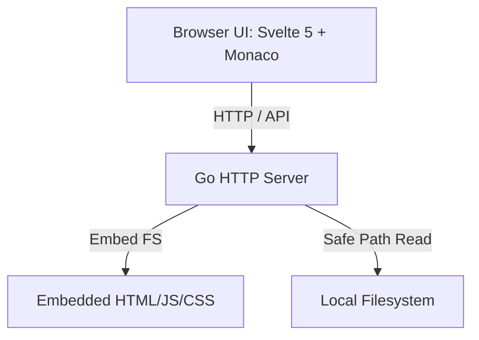

# Vidian 🔍

A lightweight, beautiful, high-performance, **read-only VS Code clone** designed for viewing and searching code. Built from the ground up with a **Go** backend and a reactive **Svelte 5** frontend embedding the **Monaco Editor** engine.

It compiles into a **single binary** with zero external dependencies.

---

## Key Features

- ⚡ **Ultra-Fast & Lightweight**: Go-powered backend serves static compiled assets and walks directory trees in milliseconds with minimal memory footprint (< 15MB RAM).
- 🎨 **Premium Modern Design**: A clean dark theme featuring hover animations, subtle borders, custom scrollbars, and color-coded file extension icons.
- 📝 **Authentic VS Code Feel**: Powered by the same editing engine as VS Code (Monaco Editor). Supports:
  - 100+ languages syntax highlighting
  - Multi-tab file viewer (caches file state, scroll, and cursor positions)
  - Code folding & brackets matching
  - Interactive minimap
  - Image previews and details card for binary files
- 🤖 **Multi-Language LSP Support**: Local background Language Server integration for **Go (`gopls`)**, **Python (`pylsp`)**, **TypeScript/JavaScript (`typescript-language-server`)**, and **Rust (`rust-analyzer`)**. Provides:
  - Hover signatures & docstrings definitions
  - Ctrl+Click jump to definition across files
  - Live red-wavy syntax/type checking markers
- 🔍 **Global Workspace Search**: Dynamic full-text content and file-path search. Highlights search queries, groups matches by file, and lets you click a match to open the editor directly at that line number.
- ⚡ **Quick Open (Ctrl + P / Cmd + P)**: Floating, keyboard-navigable command palette that allows you to instantly search and jump to any file in the workspace.
- 📊 **Real-time Status Bar**: Tracks cursor positions (`Ln X, Col Y`), automatically identifies file language formats, and displays sync state.
- 🔒 **Path Traversal Protection**: Backend cleans and validates requested paths against the workspace root to prevent directory traversal exploits.

---

## Architecture Overview



---

## How to Build & Run

### 1. Build from Source
If you make changes, you can compile the entire application into a single binary:

```bash
# 1. Build the frontend assets
cd frontend
npm install
npm run build
cd ..

# 2. Compile Go binary with embedded assets
go build -o vidian cmd/vidian/main.go
```

### 2. Run
Run the executable and point it to any directory you want to inspect:

```bash
./vidian -dir /path/to/your/workspace -port 8080
```
Then, open **[http://localhost:8080](http://localhost:8080)** in your browser!

### 3. Development Mode
During frontend development, you can run the backend in `-dev` mode which serves files directly from the filesystem (so you don't need to re-compile the Go binary when you edit Svelte files):

```bash
# In terminal 1 (start frontend dev server):
cd frontend
npm run dev

# In terminal 2 (start backend in dev mode):
go run cmd/vidian/main.go -dir . -dev -port 8080
```

---

## Running Workflow Tests

To ensure changes do not break existing functionality (such as Monaco Editor mounting, explorer navigation, git integration, or Monaco Diff Editor rendering), Vidian includes an automated End-to-End integration test suite using Puppeteer.

You can run the entire workflow build-and-test cycle using a single script at the root:

```bash
./run-tests.sh
```

This script automatically:
1. Re-builds the Svelte frontend assets.
2. Compiles the Go backend server.
3. Launches the server in development mode.
4. Executes the headless browser tests in Chromium, verifying core editor actions and ensuring zero uncaught browser console exceptions or layout failures.

---

## Keyboard Shortcuts

| Shortcut | Action |
| :--- | :--- |
| <kbd>Ctrl</kbd> + <kbd>P</kbd> | Open Quick Open Palette (Search/jump to file) |
| <kbd>Ctrl</kbd> + <kbd>B</kbd> | Toggle Sidebar panel visibility |
| <kbd>Ctrl</kbd> + <kbd>Shift</kbd> + <kbd>F</kbd> | Toggle search panel / focus search input |
| <kbd>Esc</kbd> | Close Quick Open Palette |
| <kbd>↑</kbd> / <kbd>↓</kbd> | Navigate files in Quick Open |
| <kbd>Enter</kbd> | Open file in Quick Open |
